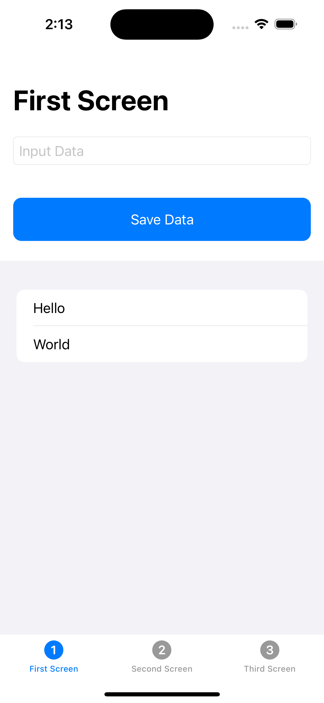
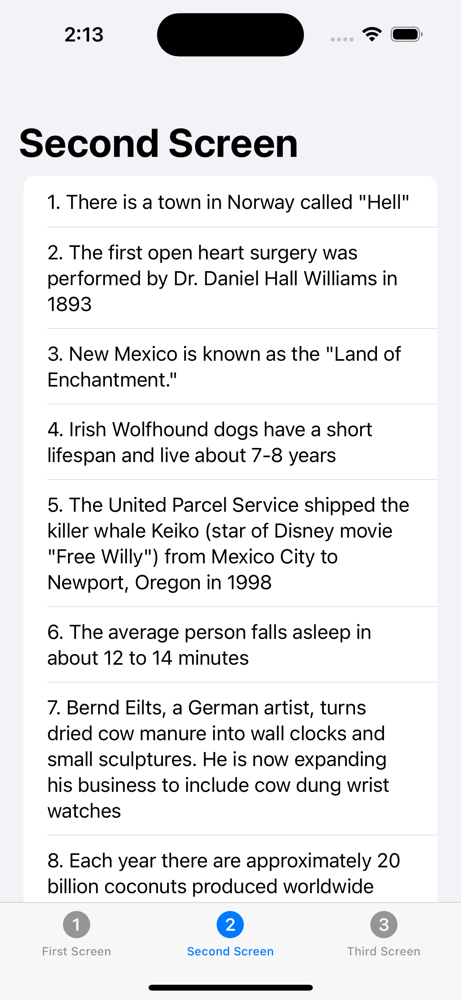
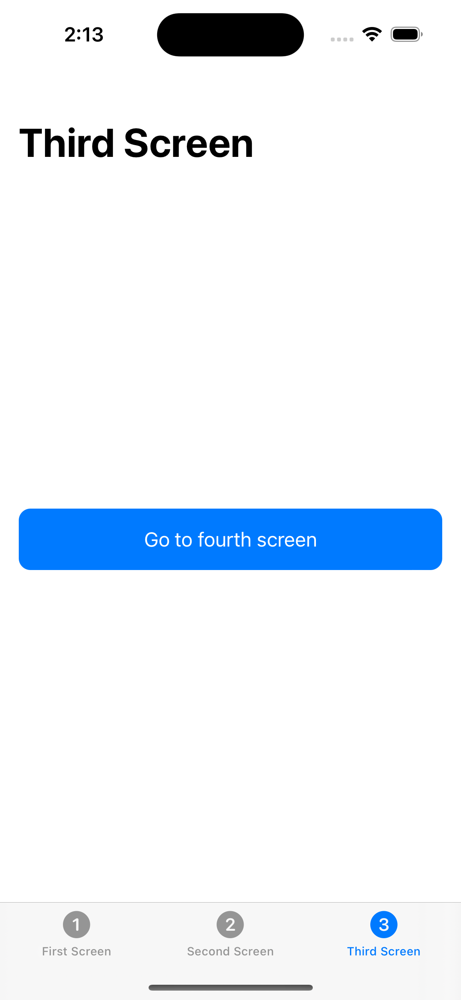
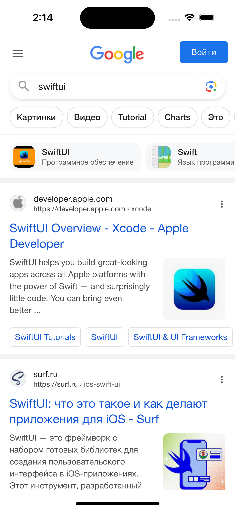

# TestApp-FourScreens

## Это тестовое приложение, где я поработал с сохранением данных - UserDefaults, AppStorage. Также использовал [API Ninjas](https://api.api-ninjas.com/v1/facts). И поработал с WebKit.
## Всё это писал на SwiftUI ❤️.

### Описание приложения:
Приложение состоит из 4х экранов, 3 из них находятся в TabView: 
- На первой экране - расположено поле ввода, кнопка сохранить и список сохраненных данных;
- На втором экране - работа с API сервисом, и при каждом переходе на этот экран осуществляется запрос, результат которого отображается на экране;
- На третьем экране - всего одна кнопка, после её нажатия приложение переходит на 4й экран;
- Четвертый экран - это отображение на весь экран WebView c ссылкой на [Google](google.com) без возможности вернуться на предыдущие 3 экрана. Также есть навигация свайпами по браузеру.

  
  
  
  

